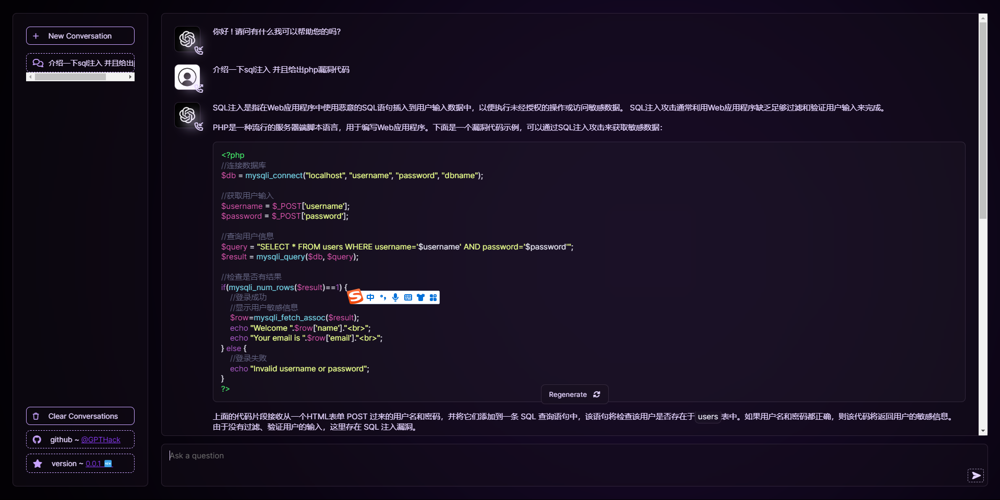
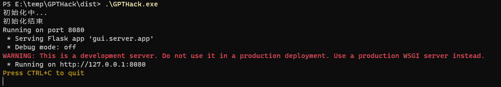

# GPTHack
更适合中国宝宝体质的GPTHack，免API使用GPT，目前支持3.5

## 简介


套用了[gpt4free](https://github.com/xtekky/gpt4free)的web界面

使用fofa-hack采集了公网[chatgpt-web](https://github.com/Chanzhaoyu/chatgpt-web)未授权的地址

然后做了些许优化

> 为什么不直接用gpt4free

用了就知道其实里面的GPT4很不稳定,GPT3.5在国内IP的情况下反应很慢,可能作者更关注于怎么找到更多的目标,而不是优化项目的使用orz

而我只是想要一个能够快速稳定查询的GPT

## 安装运行

### 运行可执行文件
下载可执行文件(仅支持windows)

`https://github.com/Cl0udG0d/GPTHack/releases`

命令行运行,等待初始化结束之后访问 http://127.0.0.1:8080
```shell
.\GPTHack.exe
```



### 代码运行
下载项目

`git clone https://github.com/Cl0udG0d/GPTHack`

安装依赖

`pip install -r requirements.txt`

运行web服务(第一次运行需要加载GPT地址 花费的时间会稍微比较长)

`python main.py`

## TODO

+ 排查一些BUG
+ 加入稳定的GPT4,如果你有比较好的GPT4网址,欢迎issue我


